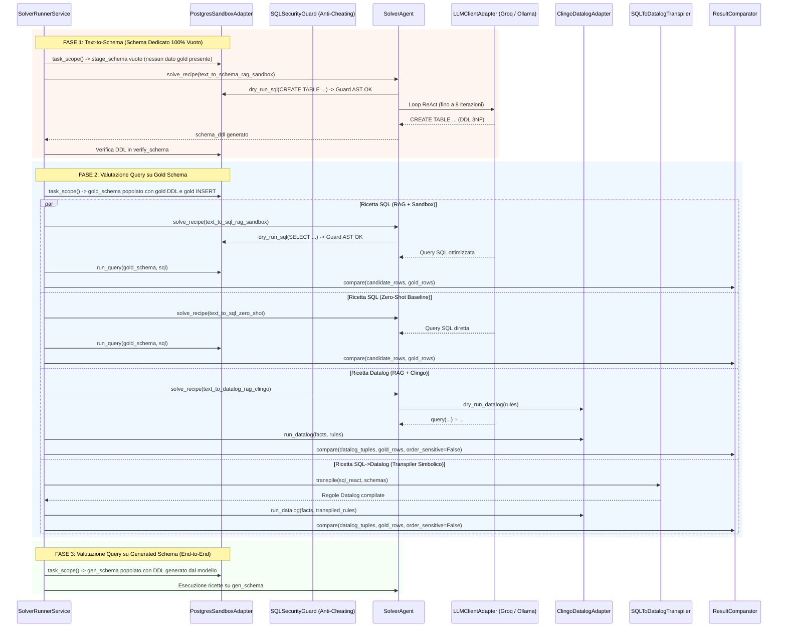

# Solver: Valutatore e Risolutore Scientifico Multi-Paradigma

`solver` e' il sistema per la valutazione automatizzata, la risoluzione agentica deterministica e l'analisi scientifica del benchmark **Text-to-PostgreSQL** e **Text-to-Datalog**. Il sistema e' progettato secondo i principi di **Architettura Esagonale (Ports and Adapters)**, **SOLID**, **Native Constructor Dependency Injection**, **SQL AST Security Sandboxing** e **ReAct Agentic Tool-Loop Orchestration**.

---

## 1. Architettura Esagonale (Layers e Componenti)

L'architettura rispetta la gerarchia di dipendenza a strati (dall'esterno verso l'interno): gli adattatori esterni comunicano con il nucleo applicativo tramite porte astratte, garantendo totale isolamento da database e infrastrutture esterne.

```mermaid
flowchart TD
    subgraph Driving [1. Inbound Driving Adapters]
        CLI[app.py<br/>CLI Controller Typer e Rich]
    end

    subgraph Application [2. Application Layer]
        Bootstrap[bootstrap.py<br/>ApplicationBootstrap Composition Root]
        
        subgraph UseCases [Application Services]
            Runner[solver_runner.py<br/>SolverRunnerService Batch Orchestrator]
            Analytics[analytics.py<br/>SolverAnalyticsService]
            Checker[system_checker.py<br/>SystemCheckService]
        end

        subgraph AgentEngine [Agentic Engine]
            Agent[solver_agent.py<br/>SolverAgent ReAct Loop]
            ToolFactory[solver_tools.py<br/>SolverToolFactory 5 StructuredTools]
        end
    end

    subgraph Domain [3. Domain Core Layer]
        DTOs[models/*.py<br/>SolverRunDTO, SolverTaskStateDTO, RecipeResultDTO, ToolTraceDTO]

        subgraph DomainServices [Pure Domain Services]
            Transpiler[sql_to_datalog_transpiler.py<br/>SQLToDatalogTranspiler]
            Comparator[result_comparator.py<br/>ResultComparator]
            Classifier[error_classifier.py<br/>ErrorClassifier]
            Guard[sql_guard.py<br/>SQLSecurityGuard Anti-Cheating]
            Calc[analytics_calculator.py<br/>SolverAnalyticsCalculator]
            DatalogUtils[datalog_utils.py<br/>build_datalog_facts]
        end

        Exceptions[exceptions/*.py<br/>SolverException e Handler singledispatch]
    end

    subgraph Driven [4. Outbound Driven Adapters]
        subgraph Ports [Outbound Abstract Ports]
            SandboxPort[sandbox_port.py<br/>SandboxPort]
            DatalogPort[datalog_port.py<br/>DatalogPort]
            DocRAGPort[rag_port.py<br/>DocRAGPort]
            LLMPort[llm_port.py<br/>LLMGeneratorPort]
            PromptPort[prompt_port.py<br/>PromptPort]
            SerializerPort[serializer_port.py<br/>SerializerPort]
            PlotterPort[plotter_port.py<br/>PlotterPort]
            ConfigPort[config_port.py<br/>ConfigPort]
        end

        subgraph Adapters [Concrete Adapters]
            PgSandbox[sandbox_adapter.py<br/>PostgresSandboxAdapter - Porta 5433]
            ClingoEngine[clingo_adapter.py<br/>ClingoDatalogAdapter - Clingo ASP]
            DocRAG[doc_rag_adapter.py<br/>DocRAGAdapter - Qdrant + FastEmbed]
            LLMRouter[llm_adapter.py<br/>LLMClientAdapter LiteLLM Router]
            PromptAdapter[prompts/__init__.py<br/>PromptAdapter File System]
            JsonSerializer[json_serializer_adapter.py<br/>JsonSerializerAdapter orjson]
            SeabornPlotter[seaborn_adapter.py<br/>SeabornSolverPlotterAdapter]
            PlotList[plotter/plots/*.py<br/>14 Classi Plot Scientifici]
            ConfigAdapter[config/__init__.py<br/>ConfigAdapter]
        end
    end

    CLI --> Bootstrap
    Bootstrap --> UseCases
    Runner --> Agent
    Runner --> Transpiler
    Runner --> Comparator
    Runner --> Classifier
    Runner --> SerializerPort
    Analytics --> Calc
    Analytics --> PlotterPort
    Analytics --> SerializerPort

    Agent --> ToolFactory
    Agent --> LLMPort
    Agent --> PromptPort
    ToolFactory --> SandboxPort
    ToolFactory --> DatalogPort
    ToolFactory --> DocRAGPort

    PgSandbox --> Guard
    PgSandbox -.-> SandboxPort
    ClingoEngine -.-> DatalogPort
    DocRAG -.-> DocRAGPort
    LLMRouter -.-> LLMPort
    PromptAdapter -.-> PromptPort
    JsonSerializer -.-> SerializerPort
    SeabornPlotter --> PlotList
    SeabornPlotter -.-> PlotterPort
    ConfigAdapter -.-> ConfigPort
```



---

## 2. Flusso di Risoluzione e Isolamento Sandbox

Ogni task del benchmark viene elaborato attraverso **schemi sandbox PostgreSQL effimeri e rigorosamente isolati** (porta 5433), impedendo collisioni DDL e fughe di dati (information leakage).



---

## 3. Sicurezza ed Anti-Cheating Sandbox (`SQLSecurityGuard`)

Per garantire la validita' scientifica del benchmark ed impedire che il modello possa ispezionare la cronologia del database o leggere dati estranei al proprio task, il servizio **`SQLSecurityGuard`** valida l'Abstract Syntax Tree (AST) di ogni query prima dell'esecuzione:

1. **Blocco Cronologia Query**: Disabilita ed intercetta accessi a `pg_stat_statements`, `pg_stat_activity`, `current_query()`, `pg_stat_get_activity()`. Se il modello tenta di leggere le query eseguite in precedenza da `bench` o da altri task, l'esecuzione viene bloccata immediatamente.
2. **Blocco Cataloghi e Metadati Interni**: Blocca accessi non autorizzati a `pg_catalog`, `information_schema`, `pg_description`, `pg_proc`, `pg_class`.
3. **Isolamento Cross-Schema**: Impedisce a qualsiasi query di specificare schemi differenti da quello temporaneo assegnato al task (es. `task_xxxxxxxxxxxx.tabella`).
4. **Blocco File-System**: Blocca funzioni di lettura file del server (`pg_read_file`, `pg_read_binary_file`, `pg_ls_dir`).

---

## 4. Router LLM, Gestione Provider e Fallback

La catena dei modelli e' configurata in `config/providers.json` ed orchestrata tramite **`LiteLLM Router`**:

- **Provider Primario (`groq/gpt-oss`)**: Esegue `openai/gpt-oss-120b` tramite le API ad altissima velocita' di **Groq**.
- **Provider Secondario / Fallback (`ollama/gpt-oss`)**: Istanza self-hosted di `gpt-oss:120b` in esecuzione sul **Mac Studio** remoto (`160.97.63.29:11434`, inoltrata via tunnel SSH a `127.0.0.1:11434`).

### Protocollo di Sintesi Forzata (Forced Final Response)
All'interno di `LLMClientAdapter.call_with_tools`:
- Il modello ha a disposizione fino a **8 iterazioni** per utilizzare liberamente gli strumenti (RAG vettoriale, validazione AST, dry-run sandbox e Clingo).
- Se il modello termina le chiamate ai tool senza emettere il codice conclusivo (o esaurisce le iterazioni), l'harness invoca automaticamente un turno finale forzato (`tools=[]`) richiedendo il codice conclusivo, eliminando del tutto le risposte vuote.
- I payload dei messaggi vengono sanificati rimuovendo campi proprietari di reasoning (`reasoning_content`, `thought`) prima del re-inoltro, garantendo piena compatibilità con le API standard OpenAI e Groq.

---

## 5. Le 5 Ricette Sperimentali del Benchmark

| N. | Identificativo Ricetta | Prompt Template | Tool Attivi | Obiettivo e Metodologia |
|:---|:---|:---|:---|:---|
| **1** | `text_to_schema_rag_sandbox` | `prompts/schema.txt` | Tutti i 5 tool | **Modellazione Relazionale (DDL 3NF)**: Generazione dello schema relazionale in uno schema isolato vuoto, testato con `dry_run_sql`. |
| **2** | `text_to_sql_rag_sandbox` | `prompts/sql_rag.txt` | Tutti i 5 tool | **Risoluzione Assistita (State-of-the-Art)**: Loop ReAct completo con RAG semantico, validazione AST e feedback di esecuzione Sandbox. |
| **3** | `text_to_sql_zero_shot` | `prompts/sql_zero_shot.txt` | Nessuno (Zero-Shot) | **Baseline Non-Assistita**: Inferenza pura diretta senza accesso a strumenti o feedback. |
| **4** | `text_to_datalog_rag_clingo` | `prompts/datalog_rag.txt` | Tutti i 5 tool | **Ragionamento Logico Neurale (ASP)**: Generazione diretta di regole dichiarative Datalog eseguite sul solver simbolico Clingo. |
| **5** | `sql_to_datalog_transpiled` | `prompts/sql_transpiled.txt` | Compilatore Simbolico | **Isomorfismo Relazionale-Logico**: Compilazione simbolico-deterministica dall'AST SQL a regole Datalog Clingo tramite `SQLToDatalogTranspiler`. |

---

## 6. Toolbox dei 5 Strumenti ReAct (`SolverToolFactory`)

1. **`search_knowledge_and_evidence(query)`**: Interroga il database vettoriale **Qdrant** (collezione `doc_knowledge`) indicizzato con `microsoft/harrier-oss-v1-0.6b` con oltre 3.061 chunk (PostgreSQL 17, BIRD-SQL, Spider, Datalog/Clingo).
2. **`validate_sql_syntax(code)`**: Valida l'AST del codice SQL/DDL tramite `sqlglot` su dialetto PostgreSQL.
3. **`validate_datalog_syntax(code)`**: Valida la correttezza formale delle regole Datalog tramite Clingo.
4. **`dry_run_sql(code)`**: Esegue istruzioni DDL o query SELECT all'interno dello schema isolato del task in **PostgreSQL 17** (porta 5433).
5. **`dry_run_datalog(rules)`**: Esegue le regole Datalog sul motore simbolico **Clingo** con i fatti relazionali del task.

---

## 7. Compilatore Simbolico SQL-to-Datalog (`SQLToDatalogTranspiler`)

- **Architettura Aggregati a Due Livelli (`GROUP BY`)**: Generazione automatica di `_helper_query(...)`, `_keys_query(...)` e `query(...)` con tuple di preservazione riga per prevenire duplicazioni insiemistiche in Clingo.
- **Virgola Fissa a Centesimi Interi**: I valori floating-point vengono scalati a centesimi interi nei fatti (`build_datalog_facts`), garantendo calcoli aritmetici esatti.
- **Top-N / Ranking (`LIMIT N`)**: Tradotto contando la cardinalita' dei record strettamente superiori via Clingo ASP.

---

## 8. Suite dei 14 Grafici Scientifici di Valutazione (`output/plots/`)

Il comando `./scripts/solver.sh stats` genera la suite completa di 14 grafici PNG ad alta risoluzione (300 DPI) con layout a 3 livelli: **Titolo formale**, **Sottotitolo metodologico (`description`)** ed **Evidenza empirica dinamica (`insight`)**.

| N. | Nome File Grafico | Categoria Analitica | Fenomeno Scientifico Misurato |
|:---:|:---|:---|:---|
| **01** | `01_schema_vs_query_contingency_matrix.png` | Schema vs Query | **Matrice di Contingenza 2x2**: Asimmetria tra deduzione DDL (Stage 1) e query SQL (Stage 2). |
| **02** | `02_schema_vs_query_accuracy_by_category.png` | Schema vs Query | **Accuratezza per Categoria**: Pass rate DDL vs SQL attraverso le categorie del benchmark. |
| **03** | `03_error_cascade_waterfall.png` | Schema vs Query | **Errore a Cascata (Waterfall)**: Perdita di accuratezza tra Gold Schema, Generated Schema ed End-to-End. |
| **04** | `04_recipe_accuracy_comparison.png` | Multi-Paradigma | **Confronto 4 Paradigmi**: SQL RAG, SQL Zero-Shot, Datalog Neurale e Transpiler Simbolico. |
| **05** | `05_datalog_direct_vs_transpiled_errors.png` | Multi-Paradigma | **Errori Datalog**: Tassonomia errori tra generazione neurale diretta e compilazione deterministica. |
| **06** | `06_error_rate_by_sql_feature.png` | Feature SQL | **Vulnerabilita' per Costrutto SQL**: Fallimento per operatore (`group_agg`, `window`, `left_join`). |
| **07** | `07_sql_feature_vs_error_type_heatmap.png` | Feature SQL | **Heatmap Bivariata**: Correlazione tra operatori SQL e tipologie di errore. |
| **08** | `08_error_rate_by_twist_type.png` | Twist Semantici | **Tasso di Errore per Twist**: Impatto di gergo, acronimi, sinonimi e distrazioni. |
| **09** | `09_twist_count_degradation_curve.png` | Twist Semantici | **Curva di Decadimento**: Accuratezza all'aumentare del numero di twist (0 -> N). |
| **10** | `10_rag_boost_by_twist_type.png` | Twist Semantici | **Guadagno Netto RAG (Delta-RAG)**: Incremento percentuale rispetto a Zero-Shot. |
| **11** | `11_tool_trajectory_and_self_correction.png` | Metacognizione | **Efficacia Autocorrezione**: Tasso di successo delle invocazioni ai tool nel loop ReAct. |
| **12** | `12_accuracy_by_table_count.png` | Complessita' | **Decadimento per Dimensione Schema**: Accuratezza in funzione del numero di tabelle (1 -> 4). |
| **13** | `13_accuracy_by_business_domain.png` | Domini Aziendali | **Accuratezza per Settore**: Performance attraverso i 12 domini aziendali. |
| **14** | `14_global_error_taxonomy.png` | Tassonomia Errori | **Distribuzione Globale Errori**: Frequenza aggregata delle cause di fallimento. |

---

## 9. Struttura del Repository

```
solver/
├── config/
│   ├── logging.json          # Configurazione logging centralizzato
│   ├── providers.json        # Configurazione LiteLLM Router (Groq primario, Ollama fallback)
│   └── solver.toml           # Parametri di runtime, DSN, Qdrant, max_tool_iterations
├── db/
│   └── docker-compose.yml    # PostgreSQL 17 (porta 5433) e Qdrant (porta 6333)
├── input/
│   └── benchmark.json        # Benchmark serializzato generato da bench
├── logs/                     # Log di esecuzione
├── output/
│   ├── plots/                # Grafici scientifici PNG ed analytics.json
│   └── runs/                 # File JSON delle run di risoluzione (solver_run_*.json)
├── prompts/                  # Template SOTA dei prompt di sistema
│   ├── datalog_rag.txt
│   ├── schema.txt
│   ├── sql_rag.txt
│   ├── sql_transpiled.txt
│   └── sql_zero_shot.txt
├── rag/                      # .gitkeep
├── scripts/
│   ├── active-tunnel.sh      # Script per tunnel SSH remoto Mac Studio
│   ├── disable-tunnel.sh
│   └── solver.sh             # Wrapper CLI per l'ambiente virtuale uv
├── src/
│   └── solver/
│       ├── adapters/         # Inbound (CLI Typer) e Outbound (Postgres, Clingo, Qdrant, LiteLLM)
│       ├── application/      # SolverAgent, SolverRunnerService, SolverAnalyticsService
│       └── domain/           # Modelli DTO, SQLSecurityGuard, Transpiler, Comparator, ErrorClassifier
├── pyproject.toml
└── README.md
```

---

## 10. Guida all'Utilizzo e Comandi CLI

### 10.1. Avvio dei Servizi di Infrastruttura
```bash
cd solver/db
docker compose up -d
```
Verifica che i container `pg_solver_db` (porta 5433) e `pg_solver_qdrant` (porta 6333) siano attivi.

### 10.2. Risoluzione Completa del Benchmark
```bash
cd solver
# Esecuzione completa su tutti i 116 task con tutte le 5 ricette
./scripts/solver.sh solve

# Esecuzione con limite di task per test rapidi
./scripts/solver.sh solve --limit 10

# Esecuzione filtrata su specifiche ricette
./scripts/solver.sh solve --recipes text_to_sql_rag_sandbox,text_to_sql_zero_shot --limit 20
```

### 10.3. Generazione Analytics e Grafici Scientifici
```bash
# Analizza automaticamente l'ultima run salvata in output/runs/ e genera i 14 grafici
./scripts/solver.sh stats
```

### 10.4. Verifica della Qualita' del Codice
```bash
uv run ruff format .
uv run ruff check .
```
